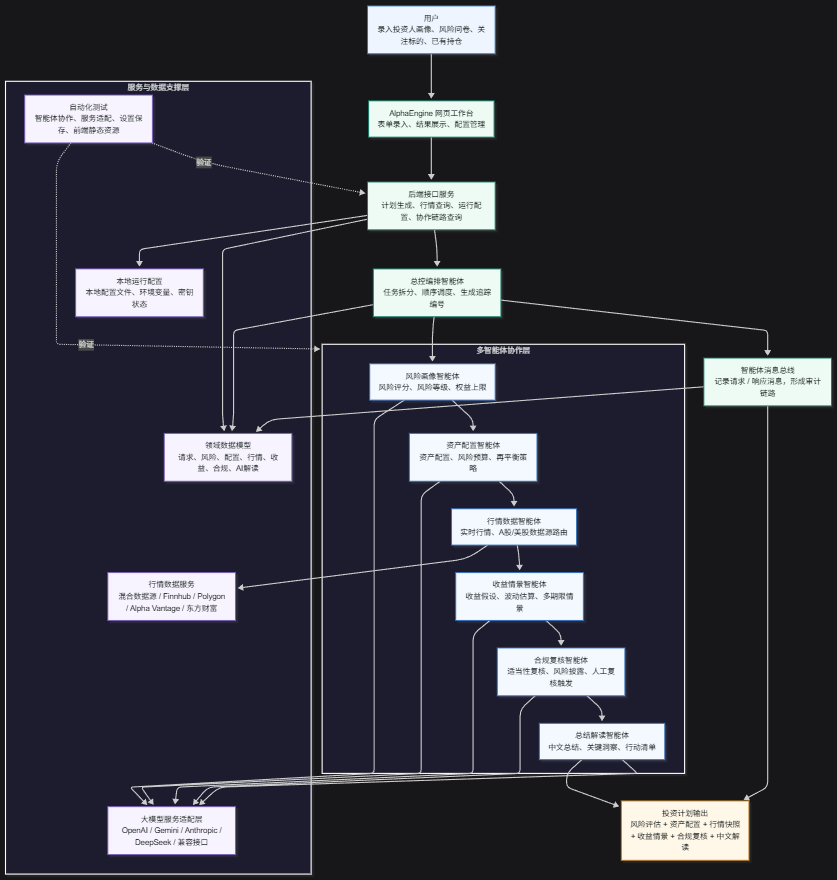

# AlphaEngine

AlphaEngine 是一个多 AI Agent 协作的智能投顾原型系统。它基于 Python、FastAPI 和原生前端实现，用 ACP 风格消息在多个专业 Agent 之间传递上下文，完成风险画像、资产配置、行情获取、收益情景、合规复核和中文解读。

> 重要：本项目输出仅用于研究、开发和产品原型演示，不构成投资建议、收益承诺或个性化投顾服务。真实投顾业务需要持牌资质、适当性流程、审计留痕、授权行情数据和本地监管合规。

## 功能特性

- 多 Agent 协作：风险、配置、行情、收益、合规、总结解读分别由独立 Agent 完成。
- 规则基线 + AI 复核：每个专业 Agent 先生成可审计规则结果，启用真实模型后再由模型复核和补充。
- 可配置 AI 提供方：支持 OpenAI、Gemini、Anthropic、DeepSeek、OpenAI Chat 兼容接口，也支持 Mock 和 Disabled 模式。
- 行情数据抽象：支持 Hybrid、Finnhub、Polygon、Alpha Vantage 和东方财富公开接口。
- 协作链路追踪：每次计划生成都会通过 `trace_id` 串联 request/result 消息，便于查看 Agent 协作过程。
- 本地 Web 工作台：支持录入投资人画像、风险问卷、关注标的和已有持仓，并展示配置、收益、合规和 AI 解读结果。

## 系统架构



核心流程：

```text
用户输入
  -> Web 工作台 / FastAPI 接口
  -> 总控编排 Agent
  -> 风险画像 Agent
  -> 资产配置 Agent
  -> 行情数据 Agent
  -> 收益情景 Agent
  -> 合规复核 Agent
  -> 总结解读 Agent
  -> 投资计划输出
```

可编辑架构图源文件见 [AlphaEngine系统架构图.mmd](./AlphaEngine系统架构图.mmd)。

## Agent 分工

| Agent                      | 职责                                                                  |
| -------------------------- | --------------------------------------------------------------------- |
| `AdviceCoordinatorAgent` | 生成 `trace_id`，按业务顺序调度各专业 Agent，并记录 ACP 消息链路。  |
| `RiskAssessmentAgent`    | 基于年龄、期限、问卷、流动性、目标和净资产占用生成风险评分与约束。    |
| `AssetAllocationAgent`   | 根据风险等级和投资目标生成资产配置桶、目标金额和再平衡策略。          |
| `MarketDataAgent`        | 通过行情服务获取 A 股、美股和配置工具的行情快照。                     |
| `ReturnAnalysisAgent`    | 基于配置权重和收益/波动假设生成预期收益、波动率和多期限情景。         |
| `ComplianceAgent`        | 输出适当性说明、风险披露、执行护栏和人工复核触发标志。                |
| `AIAdvisorAgent`         | 汇总各 Agent 结果，生成结构化中文总结、关键洞察、行动事项和限制说明。 |

## 技术栈

- 后端：Python 3.12、FastAPI、Pydantic、httpx、WebSocket
- 前端：HTML、CSS、JavaScript
- AI 服务：OpenAI Responses、OpenAI Chat 兼容接口、Gemini Generate Content、Anthropic Messages、DeepSeek Chat Completions
- 行情服务：Finnhub、Polygon、Alpha Vantage、东方财富公开行情
- 测试：pytest、pytest-asyncio、httpx MockTransport

## 项目结构

```text
app/
  acp/              ACP 风格消息和内存消息总线
  agents/           多智能体实现
  api/              FastAPI 路由
  core/             配置和本地配置读取
  domain/           Pydantic 领域模型
  services/         行情服务和 AI 服务适配层
  static/           前端工作台
tests/              自动化测试
start.py            本地一键启动脚本
alphaengine_agents.png
AlphaEngine系统架构图.mmd
```

## 快速开始

推荐使用 `uv`：

```powershell
uv sync --extra dev
copy .env.example .env
python start.py
```

`start.py` 会自动寻找可用端口并打开前端工作台。如果系统环境变量和 `.env` 都没有指定行情源，启动器会默认使用 `hybrid` 行情。

也可以手动启动服务：

```powershell
uv run uvicorn app.main:app --reload
```

启动后访问：

- `GET /`：前端工作台
- `GET /health`：运行状态和当前 provider
- `GET /api/v1/agents`：Agent 列表
- `GET /api/v1/settings`：运行配置
- `PUT /api/v1/settings`：更新本地配置
- `GET /api/v1/market/quotes?symbols=600519.SH,000001.SZ,AAPL,MSFT`
- `POST /api/v1/advice/plans`：生成投资计划
- `GET /api/v1/acp/traces/{trace_id}`：查看 ACP 协作链路
- `WS /api/v1/market/ws/AAPL`：Finnhub WebSocket 转发

## 配置说明

本地配置来源包括环境变量、`.env` 和前端“配置源”弹窗。前端保存的配置会写入 `.alphaengine.local.json`，该文件已加入 `.gitignore`，不要提交密钥。

### 行情源

默认行情 provider 是 `hybrid`：

- A 股：`600519`、`600519.SH`、`000001.SZ` 会走东方财富公开行情接口，返回源标记为 `eastmoney-unofficial`。
- 美股：`AAPL`、`MSFT`、`SPY` 会优先走 Finnhub；没有 Finnhub key 但有 Polygon key 时走 Polygon；再没有时会尝试 Alpha Vantage；都没有配置时，请求美股标的会返回配置错误。

常用配置：

```powershell
ALPHA_MARKET_DATA_PROVIDER=hybrid
FINNHUB_API_KEY=replace-me
POLYGON_API_KEY=replace-me
ALPHA_VANTAGE_API_KEY=replace-me
```

也可以将 `ALPHA_MARKET_DATA_PROVIDER` 设置为 `alphavantage`，单独使用 Alpha Vantage 的 `GLOBAL_QUOTE` 快照接口。A 股常用输入如 `000001.SZ` 会被转换为 Alpha Vantage 使用的 `000001.SHZ` 查询格式，返回结果仍展示为 `000001.SZ`。

### AI 提供方

默认 AI provider 是 `openai`，生成计划时会调用真实模型。未配置模型 API Key 时，应用仍可启动和打开配置页，但生成投资计划会返回配置错误。

```powershell
ALPHA_AI_ADVISOR_PROVIDER=OpenAI
OPENAI_API_KEY=replace-me
```

启用真实模型时可选择：

```powershell
ALPHA_AI_ADVISOR_PROVIDER=OpenAI
OPENAI_API_KEY=replace-me
ALPHA_OPENAI_MODEL=gpt-5.4-mini
```

也可以在前端分别为风险、配置、收益、合规、总结 5 个 AI Agent 配置不同模型系，例如风险 Agent 使用 Gemini、配置 Agent 使用 Anthropic Claude、收益 Agent 使用 DeepSeek、总结 Agent 使用 OpenAI GPT。

支持的模型接口类型：

- OpenAI Responses
- OpenAI Chat 兼容接口
- Gemini Generate Content
- Anthropic Messages
- DeepSeek Chat Completions

如需关闭 AI 解读：

```powershell
ALPHA_AI_ADVISOR_PROVIDER=disabled
```

旧配置中的 `auto` 仍可读取兼容，但新界面不再展示它。

## 示例请求

保存为 `request.json`：

```json
{
  "user_id": "demo-user",
  "profile": {
    "age": 32,
    "annual_income": 300000,
    "net_worth": 800000,
    "initial_capital": 200000,
    "investment_horizon_years": 8,
    "liquidity_need": "medium",
    "investment_objective": "growth",
    "risk_answers": [4, 4, 3, 5, 4],
    "current_positions": [
      {
        "symbol": "AAPL",
        "quantity": 20,
        "average_cost": 170
      }
    ]
  },
  "symbols": ["600519.SH", "000001.SZ", "AAPL", "MSFT", "SPY"],
  "include_acp_trace": true
}
```

调用接口：

```powershell
curl -X POST http://127.0.0.1:8000/api/v1/advice/plans `
  -H "Content-Type: application/json" `
  -d "@request.json"
```

## 测试

```powershell
uv run pytest
```

当前测试覆盖：

- Agent 协作流程与 ACP trace
- OpenAI、OpenAI 兼容、Gemini、Anthropic、DeepSeek provider 构建和请求格式
- Finnhub、Polygon、Alpha Vantage、东方财富和 Hybrid 行情 provider
- 本地配置保存、密钥清除和每个 Agent 的模型配置
- 前端静态页面和资源加载
- `start.py` 行情源默认逻辑

## 安全与限制

- 东方财富公开行情源适合本地演示，稳定性和授权边界不能等同于交易所授权数据。
- Finnhub、Polygon、Alpha Vantage 和各大模型 API 的可用性取决于密钥、网络、额度和订阅权限。
- 系统默认不生成 Mock 行情或 Mock AI 解读；行情、额度、密钥或模型接口异常会以错误形式返回。
- 输出中出现的资产配置、收益情景和合规提示均为原型系统生成，不可作为真实交易依据。
